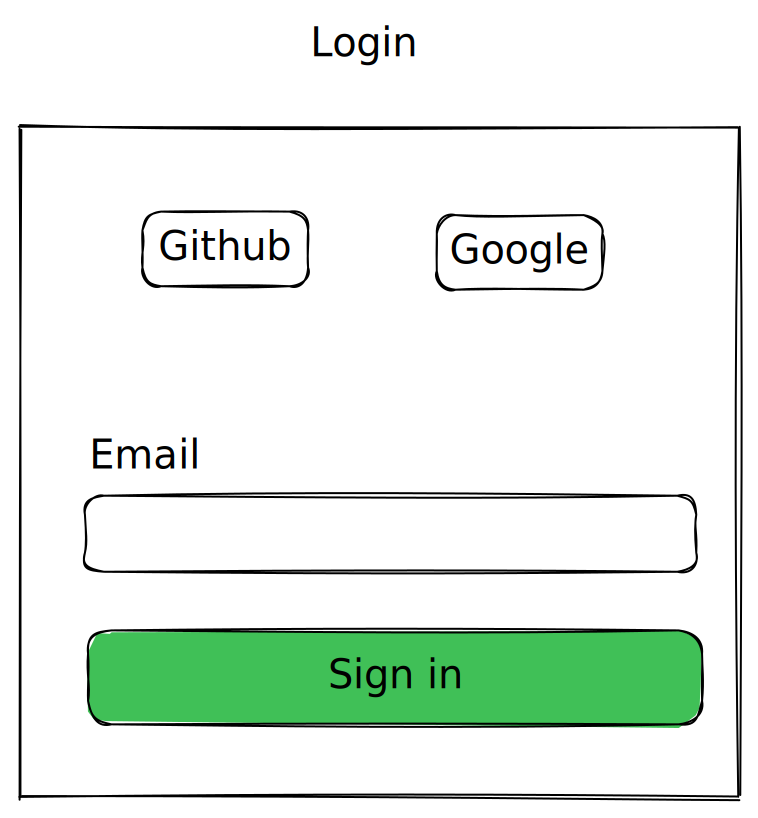
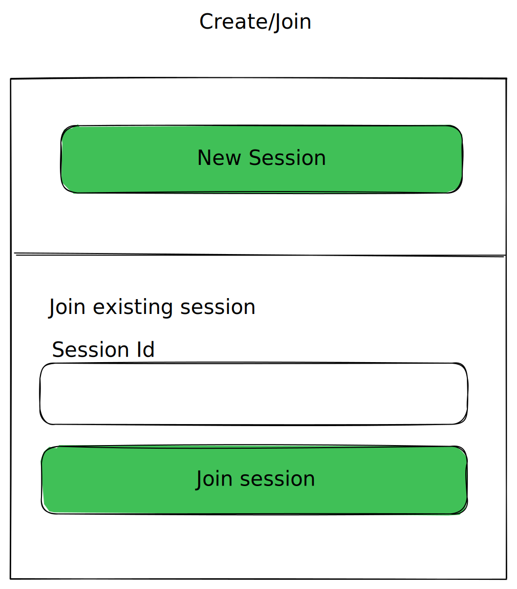
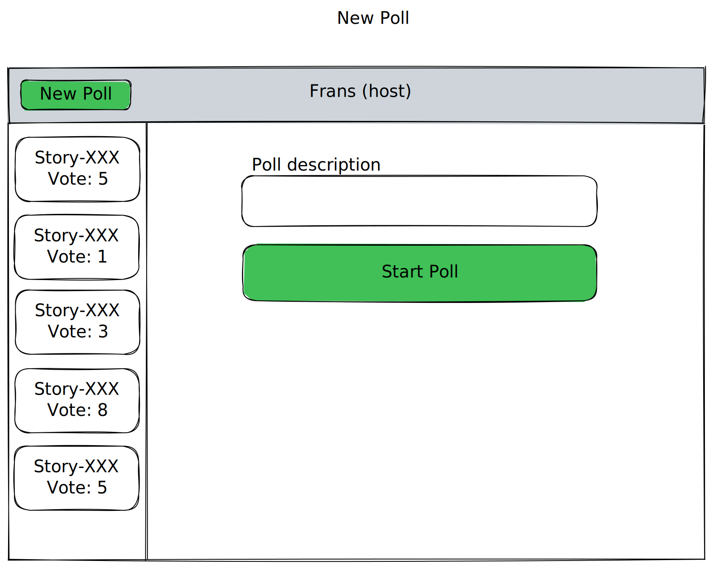
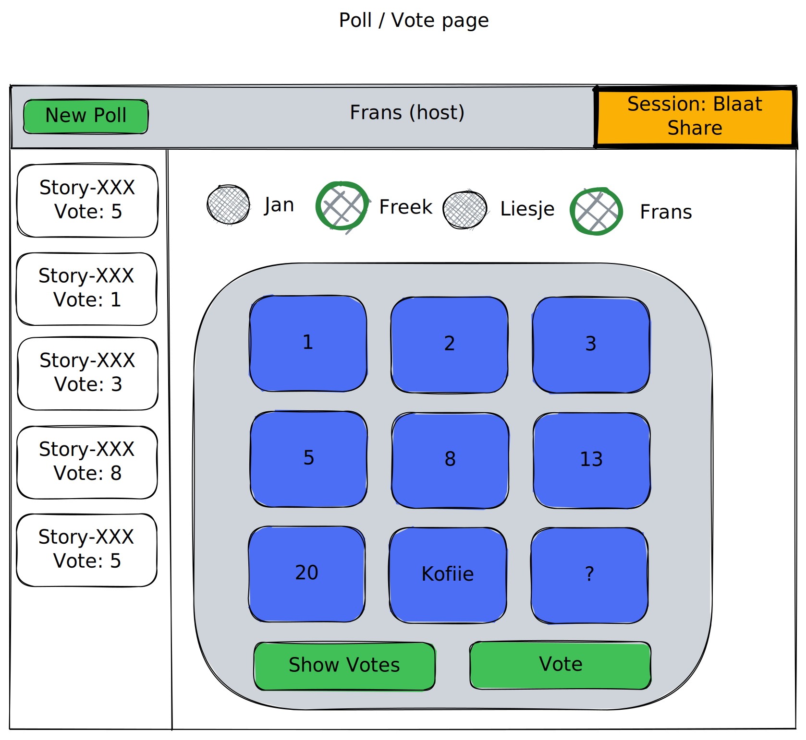
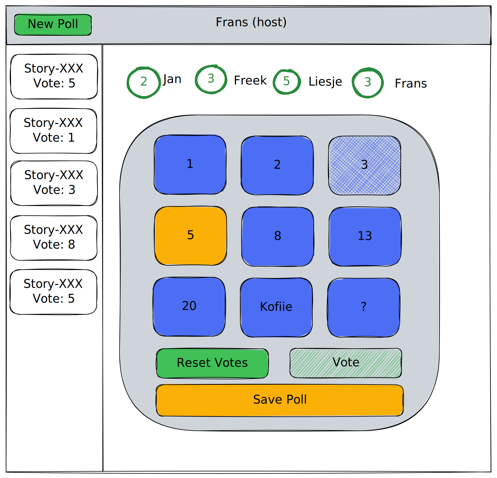

# planning-poker-frenzy

Playground to test different frontend frameworks.

- [QwikCity](https://qwik.builder.io/qwikcity/overview/)
- [NextJS 13 with T3](https://github.com/t3-oss/create-t3-app)
- [Remix](https://remix.run/)
- [SvelteKit](https://kit.svelte.dev/)
- [Astro](https://astro.build/)

## Styling

[Tailwind](https://tailwindcss.com/) should be used for most styling.

- [ ] is tailwind a better solution than css-in-js

## Database

The apps should use [Supabase](https://supabase.com/) to store data and have real-time updates on sessions.

- [ ] check if prisma can work with supabase

### Datamodel

- [ ]  should we use nosql model?
- [ ]  define event model?

## UX

### Login Page

Login with

- Github
- Google
- Magic link

### Session Page

Create new session and join existing session

### New Poll Page

Start new poll with for example a story name

- create new poll
- see past polls (read only)

### Vote Page

- vote on poll
- see current active users in session
- see who already voted
- see who is host
- see current session id
- share current session id
- reset votes
- show votes
  - if not al users in session voted a popup should show up with a warning
- see past polls (hidable)

### Voted Page

- see own vote
- submit result
- see everyones vote
- reset votes
- adjust vote disabled

## Authentication

<https://supabase.com/auth>

- [ ] github
- [ ] google
- [ ] magic link

## Deployment

- [ ] Vercel
  - <https://vercel.com/docs/concepts/monorepos>
  - <https://vercel.com/blog/monorepos>
  - max 3 deployables and project from same git repo
    - [nextjs t3](https://vercel.com/guides/deploying-nextjs-with-vercel)
    - [svelte](https://vercel.com/guides/deploying-svelte-with-vercel)
- [ ] cloudflare
  - [qwik](https://developers.cloudflare.com/pages/framework-guides/deploy-a-qwik-site/)
  - [astro](https://developers.cloudflare.com/pages/framework-guides/astro/)
- [ ] flyio
  - [remix](https://fly.io/docs/languages-and-frameworks/remix/)
